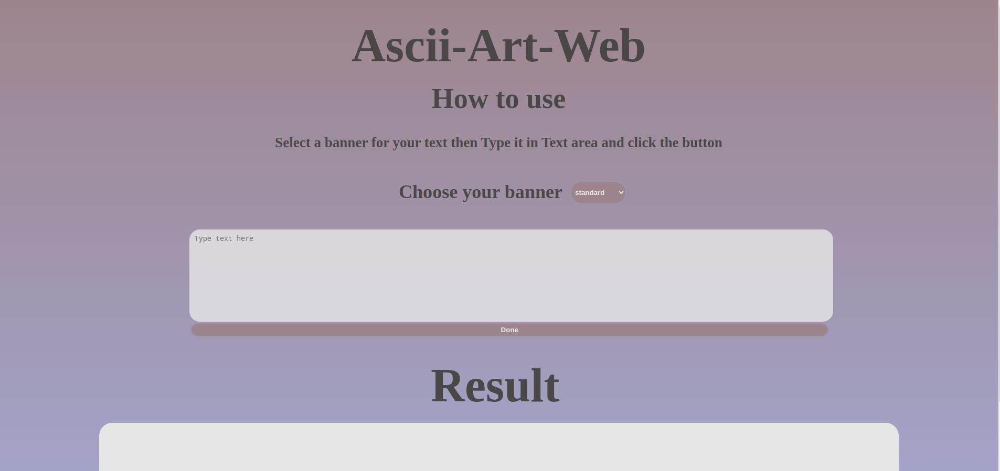
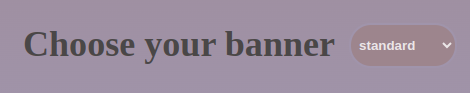
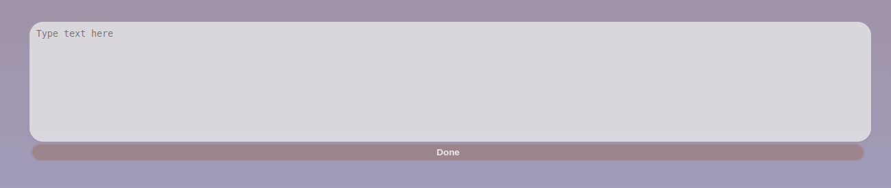
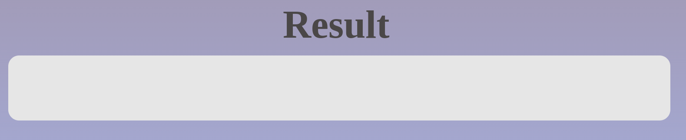

# Ascii-art-web

Ascii-art-web consists in creating and running a server, in which it will be possible to use a web GUI (graphical user interface) version of the last project, ascii-art.

## Authors

- **Hamza Elkhawlani** [GitHub Profile](https://github.com/heeemzaaa)
- **Yassine Fawzi** [GitHub Profile](https://github.com/yassinefawzi)

## Usage

### Installation 

1. Clone the repository:
   ```bash
   git clone ...

2. Navigate to the project directory:
   cd ascii-art-web/

### How to use

1. Run the program:
   ```bash
   go run main.go

2. Go to the browser:
   
3. Type this, then press enter:
   localhost:8080/

4. This is what you're going to see:
   

5. Choose a banner here,this made you text stylized:
   

6. Type your text here , then click done:
   

7. Finally, you'll see the result here:
   


## Implementation details:

   First of all we created two functions , the first one to show us our html page with and without the result , the second one to generate the ascii art and pass it's result to the first one with the "/" path. so after we run the server , we work with the two handlers function in the main using handlefunc function of the http package in go.
